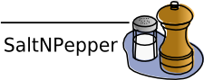

# pepperModules-EXMARaLDAModules
This project provides an im- and an exporter to support the [EXMARaLDA](http://exmaralda.org/) format in linguistic converter framework Pepper (see https://u.hu-berlin.de/saltnpepper). A detailed description of the importer can be found in section [EXMARaLDAImporter](#importer).

Pepper is a pluggable framework to convert a variety of linguistic formats (like [TigerXML](http://www.ims.uni-stuttgart.de/forschung/ressourcen/werkzeuge/TIGERSearch/doc/html/TigerXML.html), the [EXMARaLDA format](http://www.exmaralda.org/), [PAULA](http://www.sfb632.uni-potsdam.de/paula.html) etc.) into each other. Furthermore Pepper uses Salt (see https://github.com/korpling/salt), the graph-based meta model for linguistic data, which acts as an intermediate model to reduce the number of mappings to be implemented. That means converting data from a format _A_ to format _B_ consists of two steps. First the data is mapped from format _A_ to Salt and second from Salt to format _B_. This detour reduces the number of Pepper modules from _n<sup>2</sup>-n_ (in the case of a direct mapping) to _2n_ to handle a number of n formats.


In Pepper there are three different types of modules:
* importers (to map a format _A_ to a Salt model)
* manipulators (to map a Salt model to a Salt model, e.g. to add additional annotations, to rename things to merge data etc.)
* exporters (to map a Salt model to a format _B_).

For a simple Pepper workflow you need at least one importer and one exporter.

## Requirements
Since the here provided module is a plugin for Pepper, you need an instance of the Pepper framework. If you do not already have a running Pepper instance, click on the link below and download the latest stable version (not a SNAPSHOT):

> Note:
> Pepper is a Java based program, therefore you need to have at least Java 7 (JRE or JDK) on your system. You can download Java from https://www.oracle.com/java/index.html or http://openjdk.java.net/ .


## Install module
If this Pepper module is not yet contained in your Pepper distribution, you can easily install it. Just open a command line and enter one of the following program calls:

**Windows**
```
pepperStart.bat 
```

**Linux/Unix**
```
bash pepperStart.sh 
```

Then type in command *is* and the path from where to install the module:
```
pepper> update de.hu_berlin.german.korpling.saltnpepper::pepperModules-pepperModules-EXMARaLDAModules::https://korpling.german.hu-berlin.de/maven2/
```

## Usage
To use this module in your Pepper workflow, put the following lines into the workflow description file. Note the fixed order of xml elements in the workflow description file: &lt;importer/>, &lt;manipulator/>, &lt;exporter/>. The EXMARaLDAImporter is an importer module, which can be addressed by one of the following alternatives.
A detailed description of the Pepper workflow can be found on the [Pepper project site](https://u.hu-berlin.de/saltnpepper). 

### a) Identify the module by name

```xml
<importer name="EXMARaLDAImporter" path="PATH_TO_CORPUS"/>
```
or
```xml
<exporter name="EXMARaLDAExporter" path="PATH_TO_CORPUS"/>
```

### b) Identify the module by formats
```xml
<importer formatName="EXMARaLDA" formatVersion="1.0" path="PATH_TO_CORPUS"/>
```
or
```xml
<exporter formatName="EXMARaLDA" formatVersion="1.0" path="PATH_TO_CORPUS"/>
```

### c) Use properties
```xml
<importer name="EXMARaLDAImporter" path="PATH_TO_CORPUS">
  <property key="PROPERTY_NAME">PROPERTY_VALUE</property>
</importer>
```
or
```xml
<exporter name="EXMARaLDAExporter" path="PATH_TO_CORPUS">
  <property key="PROPERTY_NAME">PROPERTY_VALUE</property>
</exporter>
```

## Contribute
Since this Pepper module is under a free license, please feel free to fork it from github and improve the module. If you even think that others can benefit from your improvements, don't hesitate to make a pull request, so that your changes can be merged.
If you have found any bugs, or have some feature request, please open an issue on github. If you need any help, please write an e-mail to saltnpepper@lists.hu-berlin.de .

## Funders
This project has been funded by the [department of corpus linguistics and morphology](https://www.linguistik.hu-berlin.de/institut/professuren/korpuslinguistik/) of the Humboldt-Universität zu Berlin, the Institut national de recherche en informatique et en automatique ([INRIA](www.inria.fr/en/)) and the [Sonderforschungsbereich 632](https://www.sfb632.uni-potsdam.de/en/). 

## License
  Copyright 2009 Humboldt-Universität zu Berlin, INRIA.

  Licensed under the Apache License, Version 2.0 (the "License");
  you may not use this file except in compliance with the License.
  You may obtain a copy of the License at
 
  http://www.apache.org/licenses/LICENSE-2.0

  Unless required by applicable law or agreed to in writing, software
  distributed under the License is distributed on an "AS IS" BASIS,
  WITHOUT WARRANTIES OR CONDITIONS OF ANY KIND, either express or implied.
  See the License for the specific language governing permissions and
  limitations under the License.


# <a name="importer">EXMARaLDAImporter</a>
To represent an EXMARaLDA model in Salt we mapped the time based event concept to the token concept of Salt. This means, that an Event in EXMARaLDA is mapped to a token in Salt. A token always needs a reference to a primary text, therefore during the mapping primary data objects are created for each tier in EXMARaLDA which has the type 't' (t for transcription). If there are two or more tiers having type 't', each will be mapped to a separate primary text. The EXMARaLDA timeline is mapped to the STimeline object of Salt. Each SToken object refers to the range (via SPointOfTime objects) of time inside the STimeline object. After mapping, the range of time of a SToken object is the same as for the corresponding Event object. Event objects not part of the marked Tier object will be mapped to a SSpan object. The value of the Event object will be mapped to an SAnnotation object with Event.value → SAnnotation.sValue and Tier.categoryName → SAnnotation.sName. The project-name of the EXMARaLDA document will be mapped to the SName of the corresponding SDocument object. To have a more user-defined way for mappings you can use the properties described in the following section.

## Properties
The table  contains an overview of all usable properties to customize the behaviour of this pepper module. The following section contains a close description to each single property and describes the resulting differences in the mapping to the salt model.
properties to customize importer behaviour

|Name of property	 |Type of property	                                            |optional/ mandatory |	default value |
|--------------------|--------------------------------------------------------------|--------------------|----------------|
|salt.tokenSeparator |String	                                                    |optional            |	-- |
|salt.TierMerge      |{Tier1.categoryname, Tier2.categoryname, …}, {…} 	            |optional            |	-- |
|salt.URIAnnotation  |Tier.categoryName	                                            |optional            |	-- |
|salt.Layers         |{layerName{Tier1.categoryName, Tier2.categoryName,...}},{...} |optional            |	-- |
|saltSemantics.POS   |Tier.categoryName	                                            |optional            |	-- |
|saltSemantics.LEMMA |Tier.categoryName	                                            |optional            |	-- |
|saltSemantics.WORD  |Tier.categoryName	                                            |optional            |	-- |
|cleanModel          |Boolean	                                                    |optional            |	-- |

### salt.tokenSeparator
With the property salt.tokenSeparatoryou can set a single sign or a sequence of signs which shall be used between the concatenation of event values representing the primary data. 
```
salt.tokenSeparator=”SIGN”
```
In case of the example given in Figure 1, the creation of primary text without setting the property “salt.tokenSeparator” will produce the primary text: “Thisisasampletext.”. With the use of a blank as separator as shown here:
```
salt.tokenSeparator=” “
```
the produced text is the following: “This is a sample text .” Note the blank between “text” and “.”. In the current EXMARaLDAImporter version, there is no possibility to avoid the superfluous blank.

### salt.TierMerge
In EXMARaLDA there is just one value per each Event object. When mapping those data to Salt, this restriction results, that a SSpan or SToken object will be created for each Event object. To avoid this, you can mark a sequence of sets of tiers to map them to a single SSpan or SToken object in Salt. This can be done with the property “salt.tierMerge”.
```
salt.tierMerge={Tier1.categoryname, Tier2.categoryname, …}, {…}
```
In this case all Event objects of tier with categorical name categoryname1 and categoryname2 refering the same time range will be mapped to a single SSToken or SSpan object. Each Event object of each set in the given sequence will be grouped. Figure 2 shows an Example of EXMARaLDA data mapped to Salt with the use of the property salt.tierMerge.
All Event objects contained in a tier to be merged, must refer to the same time ranges. Gaps in time line are allowed, see the events of column 3:


and the mapped salt model .


The two figures above show the representation in EXMARaLDA Partitur Editor, beyond the representation in Salt after mapping with the properties: 
```
salt.token=txt salt.tokenSeparator=” ” salt.tierMerge={txt, pos, lemma} 
```

Two events contained in tiers to merge, which overlapps the time ranges (timeRange1 and timeRange1) with timeRange1.start ≤ timeRange2.start and timeRange1.end > timeRange2.end, vice versa and are not allowed.

### salt.URIAnnotation
With the property salt.URIAnnotation, you can mark a Tier object containing annotations, which are references in URI notation and are not simple String values. When mapping the data to Salt the resulting SAnnotation.sValue objects will be typed as URI values, so that each interpreting tool can interpret them as references.
```
salt.URIAnnotation=Tier.categoryName
```

### salt.Layers
With the property salt.layers you can use the layer mechanism of Salt. This means, with this property, you can map all SToken or SSpan object caused by Event objects to an SLayer object. You can also group SToken or SSpan coming from Event objects contained in several Tier objects to the same SLayer object. 
```
salt.layers={layerName{Tier1.categoryName, Tier2.categoryName,...}},{...}
```

Imagine the example of figures 


and


The two figures above show the representation in EXMARaLDA Partitur Editor, beyond the representation in Salt after mapping with the properties: 
```
salt.token=txt salt.tokenSeparator=” ” salt.tierMerge={txt, pos, lemma} salt.layers={syntax{unit}}, {morphosyntax{pos, lemma}} 
```
Here we grouped the events of the tiers pos and lemma to one SLayer object named morphosyntax and we grouped the event of tier unit to another SLayer object named syntax.

### saltSemantics.POS
You can influence the creation of objects in Salt to have a more semantic typing when mapping data to Salt. Here we provide three properties which can be used for a closer definition or typing of SAnnotation, SToken or SSpan objects conform to ISOCat1. This can be important in the case of a further processing with Pepper. Some modules exist, which only can deal with semantical enriched data for example they need a special kind of annotation like part-of-speech for their processing. The currently available semantic enrichments are:

When using the property saltSemantics.POS, the EXMARaLDAImporter will create a special SPOSAnnotation instead of a simple attribut-value-pair annotation. 

### saltSemantics.LEMMA
You can influence the creation of objects in Salt to have a more semantic typing when mapping data to Salt. Here we provide three properties which can be used for a closer definition or typing of SAnnotation, SToken or SSpan objects conform to ISOCat1. This can be important in the case of a further processing with Pepper. Some modules exist, which only can deal with semantical enriched data for example they need a special kind of annotation like part-of-speech for their processing. The currently available semantic enrichments are:

When using the property saltSemantics.LEMMA, the EXMARaLDAImporter will create a special SLemmaAnnotation instead of a simple attribut-value-pair annotation.

### saltSemantics.WORD
You can influence the creation of objects in Salt to have a more semantic typing when mapping data to Salt. Here we provide three properties which can be used for a closer definition or typing of SAnnotation, SToken or SSpan objects conform to ISOCat1. This can be important in the case of a further processing with Pepper. Some modules exist, which only can deal with semantical enriched data for example they need a special kind of annotation like part-of-speech for their processing. The currently available semantic enrichments are:

When using the property saltSemantics.WORD a structural object like a SSToken or a SSpan object will be additionally annotated to represent a word.

### cleanModel
Given two or more timeline objects having no corresponding event object on token tier, setting this property to true will create artificial event objects, having empty values. In an EXMARaLDA model it is possible, to have annotations which just overlap a part of the primary data. This is possible, because of the event-based concept of EXMARaLDA. Imagine the following sample: 


Setting this property to true, adds an additional event in tier 'primary data' corresponding to event 'anno2' in tier 'annotation'. 
